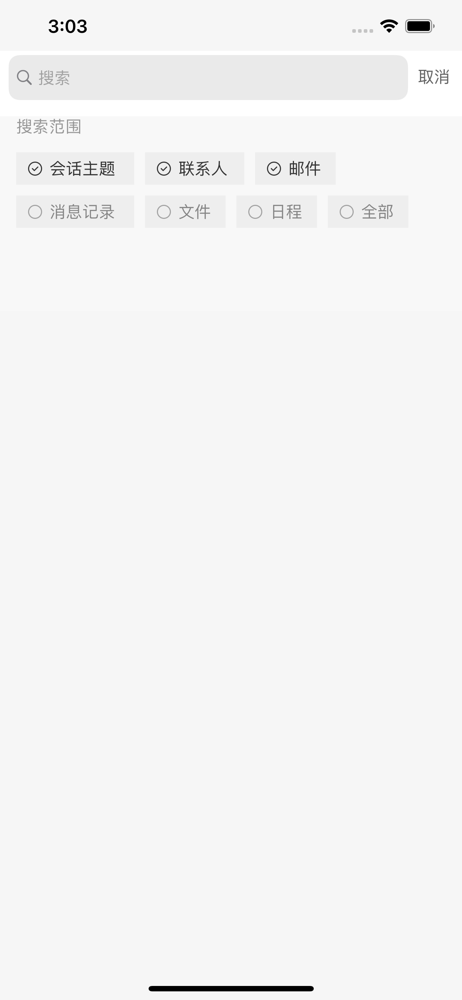
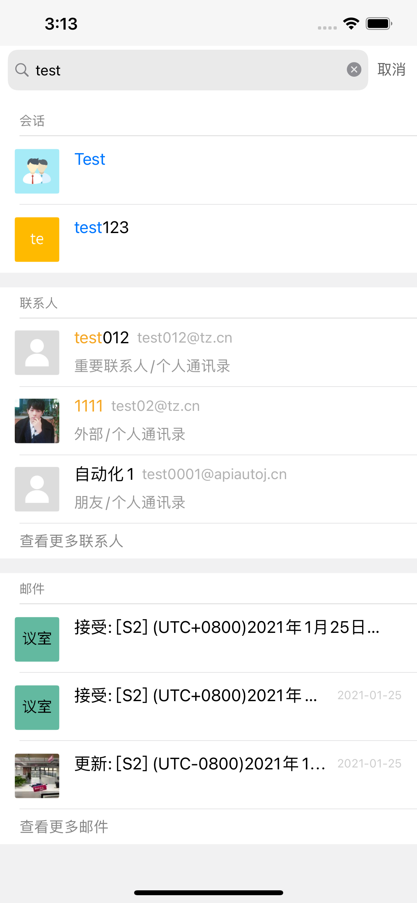

项目中比较多使用到UISearchController，UISearchController的API设计比较烦，需要UISearchController+resultController配合，还没加搜索逻辑进去。所以为了规范搜索功能的调用，和为后续搜索相关做扩展，设计了一个调用方案。

> [代码](https://github.com/zhenghongyi/myShared/Search/SearchHelper.swift)。

> 这套设计，主要是利用三个协议，SearchVCPtl、SearchResultPtl 和 SearchPtl。

> SearchPtl 负责搜索逻辑，协议是最简单的，只有一个方法：传入搜索关键字，输出匹配结果

> SearchVCPtl 对应UISearchController，SearchResultPtl 对应resultController，协议中的大部分方法都是对应UISearchController相关的两个协议（UISearchControllerDelegate和UISearchResultsUpdating），present和dismiss可以用来做清理重置工作。

> 另外，搜索结果展示多为列表形式，selectBlock作为点击结果选项的回调。

> 三者以SearchHelper作为桥梁，彼此之间减少耦合，方便维护和扩展。并且由于搜索逻辑独立抽出，在后续需求中，这个搜索逻辑可以被继承扩展，也可以被组合使用，扩大搜索范围。

## 使用

使用的时候，只需要实现对应的协议，将这三个协议对象传入到SearchHelper中就可以。

比如我们需要搜索联系人

各个协议的实现：

```
class MySearchController: UISearchController, SearchVCPtl {
    var updateBlock: ((String?) -> Void)?

    var willPresent: ((UISearchController?) -> Void)?

    var willDismiss: ((UISearchController?) -> Void)?
}

class MySearchResultVC: UITableViewController, SearchResultPtl {
    var datas:[Any] = []

    func willSearch(keyWord: String?) {
        // Show Loading
    }

    func update(success: Bool, result: Any?, keyWord: String?, error: Error?) {
        if let temp = result as? [Any] {
            datas.append(contentsOf: temp)
            tableView.reloadData()
        }
    }

    func present(_ searchVC: UISearchController?) {
        datas.removeAll()
        tableView.reloadData()
    }

    func dismiss(_ searchVC: UISearchController?) {
        // End Loading
    }

    var selectBlock: ((Any?, IndexPath?) -> Void)?

    override func tableView(_ tableView: UITableView, didSelectRowAt indexPath: IndexPath) {
        selectBlock?(datas[indexPath.row], indexPath)
    }
}

class ContactSearch: NSObject, SearchPtl {
    func search(key: String?, finish: ((Bool, Any?, Error?) -> Void)?) {
        // 发起搜索请求，返回匹配数据
    }
}
```

配置到SearchHelper中使用

```
func setupSearch() {
    let resultVC = MySearchResultVC()
    let searchVC = MySearchController(searchResultsController: resultVC)
    let search = ContactSearch()

    let searchHP = SearchHelper(searchPtl: search, resultPtl: resultVC, searchVCPtl: searchVC)
    searchVC.searchResultsUpdater = searchHP
    searchVC.delegate = searchHP
    
    self.searchHP = searchHP
}
```

### 扩展

后面可能需求改了，要求这里不是搜索联系人，而且做为全局搜索，即联系人、邮件、会话消息这些都要去搜，但界面保持原样。那么我们只需要将这三种 SearchPtl 逻辑组合起来使用就可以了

```
class GlobalSearch: NSObject, SearchPtl {
    let search1 = ContactSearch()
    let search2 = MailSearch()
    let search3 = MessageSearch()
    
    func search(key: String?, finish: ((Bool, Any?, Error?) -> Void)?) {
        search1.search(key: key) { (success, data, error) in
            // 处理单个搜索选项匹配结果
        }
        search2.search(key: key) { (success, data, error) in
            // 处理单个搜索选项匹配结果
        }
        search3.search(key: key) { (success, data, error) in
            // 处理单个搜索选项匹配结果
        }
    }
}

let resultVC = MySearchResultVC()
let searchVC = MySearchController(searchResultsController: resultVC)
let search = GlobalSearch()
let searchHP = SearchHelper(searchPtl: search, resultPtl: resultVC, searchVCPtl: searchVC)
```
 
 

***

目前这套设计有个问题，那就是由于解耦了，使用时需要配置的东西比较多：最基本的三个属性，selectBlock，UISearchControllerDelegate和UISearchResultsUpdating，差不多就是5个左右，所以可能会需要额外一个方法专门去配置这个，但相比起解耦后的效果，这个缺点还是可以接受的。